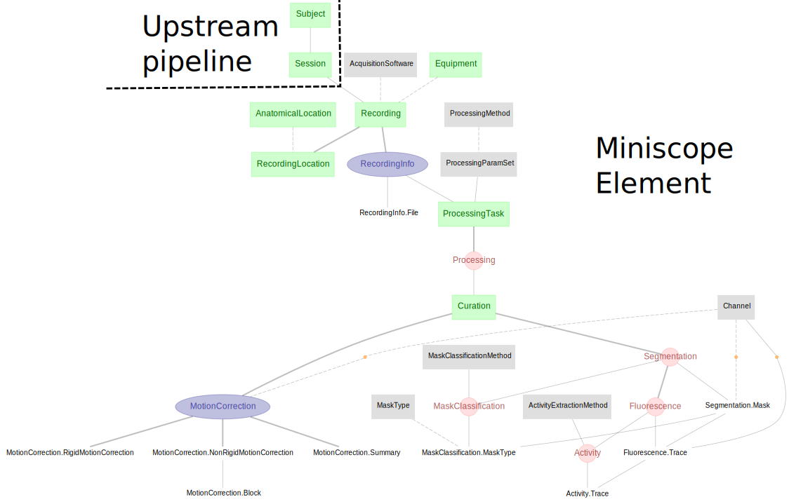

# DataJoint Element - Miniscope Calcium Imaging

+ This repository features a DataJoint pipeline design for functional calcium imaging 
data acquired with the UCLA Miniscope and `Miniscope DAQ V4` acquisition system, and 
analyzed with `CaImAn`.

+ The element presented here is not a complete workflow by itself,
 but rather a modular design of tables and dependencies specific to the miniscope 
 functional calcium imaging workflow.

+ This modular element can be flexibly attached downstream to any particular design of 
experiment session, thus assembling a fully functional miniscope workflow.

+ See the [Element Miniscope documentation](
    https://elements.datajoint.org/description/miniscope/) for the background 
    information and development timeline.

+ For more information on the DataJoint Elements project, please visit 
https://elements.datajoint.org.  This work is supported by the National Institutes of 
Health.

## Element architecture



+ As the diagram depicts, `elements-miniscope` starts immediately downstream from 
`Session`, and also requires some notion of:

    + `Equipment` for equipment/device

    + `AnatomicalLocation` as a dependency for `RecordingLocation`

## Table definitions

The `miniscope` schema contains all tables in this Element, including for the 
acquired metadata and analysis results.

### Recording

<details>
<summary>Click to expand details</summary>

+ A `Session` (more specifically an experimental session) may have multiple recordings, 
where each recording describes a complete 3D dataset (i.e. 2d image over time) from one 
recording session, typically from the moment of pressing the start button to pressing 
the stop button.

+ `Recording` - table containing information about the equipment used 
(e.g. the acquisition hardware information)

+ `RecordingInfo` - metadata about this recording from the Miniscope DAQ software 
(e.g. frame rate, number of channels, frames, etc.)

</details>

### Motion correction

<details>
<summary>Click to expand details</summary>

+ `MotionCorrection` - motion correction information performed on a recording

+ `MotionCorrection.RigidMotionCorrection` - details of the rigid motion correction 
(e.g. shifting in x, y)

+ `MotionCorrection.NonRigidMotionCorrection` and `MotionCorrection.Block` tables are 
used to describe the non-rigid motion correction.

+ `MotionCorrection.Summary` - summary images after motion correction 
(e.g. average image, correlation image, etc.)

</details>

### Segmentation

<details>
<summary>Click to expand details</summary>

+ `Segmentation` - table specifies the segmentation step and its outputs, following the
 motion correction step.

+ `Segmentation.Mask` - image mask for the segmented region of interest

+ `MaskClassification` - classification of `Segmentation.Mask` into a type
 (e.g. soma, axon, dendrite, artifact, etc.)

</details>

### Neural activity extraction

<details>
<summary>Click to expand details</summary>

+ `Fluorescence` - fluorescence traces extracted from each `Segmentation.Mask`

+ `ActivityExtractionMethod` - activity extraction method (e.g. deconvolution) applied
 on the fluorescence trace

+ `Activity` - computed neuronal activity trace from fluorescence trace (e.g. spikes)

</details>

## Installation

+ The installation instructions can be found at the
[DataJoint Elements documentation](https://elements.datajoint.org/usage/install/).

+ Install `element-miniscope`
     ```
     pip install element-miniscope
     ```

+ Install `element-interface`

     + `element-interface` contains data loading utilities for `element-miniscope`.

     + `element-interface` is a dependency of `element-miniscope`, however it is not
       contained within `requirements.txt`, therefore, must be installed in addition to
       the installation of the `element-miniscope`. 
       ```bash pip
       install "element-interface @ git+https://github.com/datajoint/element-interface"
       ```

     + `element-interface` can also be used to install packages used for reading
       acquired data and running analysis (e.g. `CaImAn`).

     + If your workflow uses these packages, you should install them when you install 
     `element-interface`.

## Usage

### Element activation

When using this Element, one needs to run `miniscope.activate` to declare the schemas 
and tables on the database.

<details>
<summary>Click to expand details</summary>

To activate `element-miniscope`, ones need to provide:

1. Schema names
    + schema name for the miniscope module

2. Upstream tables
    + Session table: A set of keys identifying a recording session (see 
        [Element-Session](https://github.com/datajoint/element-session)).
    + Equipment table: A reference table for Recording, specifying the equipment used
      for the acquisition (see 
        [example pipeline](https://github.com/datajoint/workflow-miniscope/blob/main/workflow_miniscope/pipeline.py)).
    + AnatomicalLocation table: A reference table for RecordingLocation, specifying 
     the brain location where the recording is acquired

3. Utility functions. See [example definitions here](https://github.com/datajoint/workflow-miniscope/blob/main/workflow_miniscope/paths.py).
    + get_miniscope_root_data_dir(): Returns your root data directory.
    + get_session_directory(): Returns the path of the session data relative to the 
    root directory.

For more details, check the docstring of `element-miniscope`:
```python
    help(miniscope.activate)
```

</details>

### Element usage

+ See the [workflow-miniscope](https://github.com/datajoint/workflow-miniscope) 
repository for an example usage of `element-miniscope`.

+ Our [YouTube tutorial](https://www.youtube.com/watch?v=nWUcPFZOSVw) walks through all 
  the key details of this Element.

## Citation

+ If your work uses DataJoint and DataJoint Elements, please cite the respective
  Research Resource Identifiers (RRIDs) and manuscripts.

+ DataJoint for Python or MATLAB
    + Yatsenko D, Reimer J, Ecker AS, Walker EY, Sinz F, Berens P, Hoenselaar A, Cotton
      RJ, Siapas AS, Tolias AS. DataJoint: managing big scientific data using MATLAB or
      Python. bioRxiv. 2015 Jan 1:031658. doi: https://doi.org/10.1101/031658

    + DataJoint (
      [RRID:SCR_014543](https://scicrunch.org/resolver/SCR_014543)
      ) - DataJoint for `<Select Python or
      MATLAB >` (version `<Enter version number>`)

+ DataJoint Elements
    + Yatsenko D, Nguyen T, Shen S, Gunalan K, Turner CA, Guzman R, Sasaki M, Sitonic D,
      Reimer J, Walker EY, Tolias AS. DataJoint Elements: Data Workflows for
      Neurophysiology. bioRxiv. 2021 Jan 1. doi:
      https://doi.org/10.1101/2021.03.30.437358

    + DataJoint Elements (
      [RRID:SCR_021894](https://scicrunch.org/resolver/SCR_021894)
      ) - Element Miniscope (version `<Enter version number>`)
